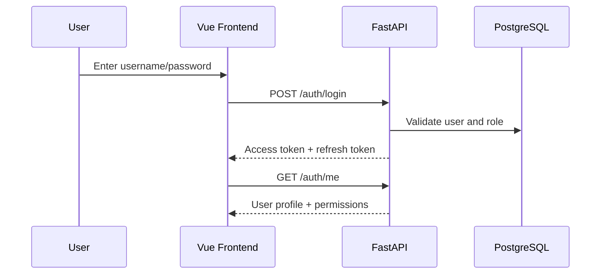
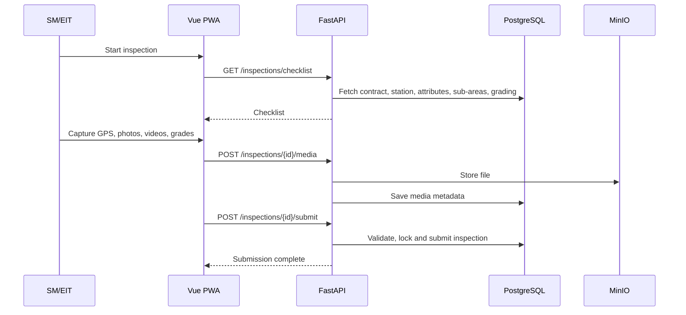
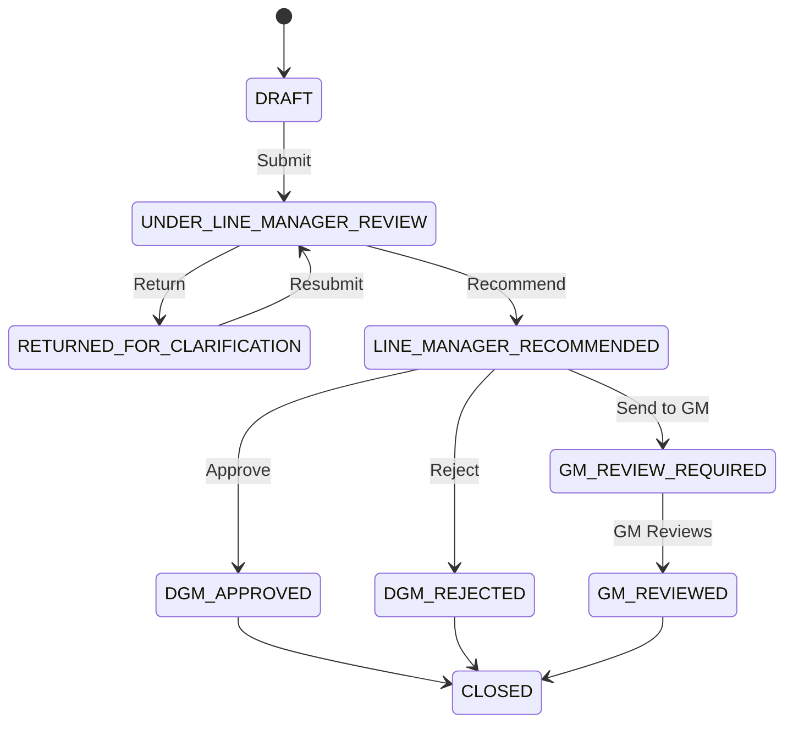
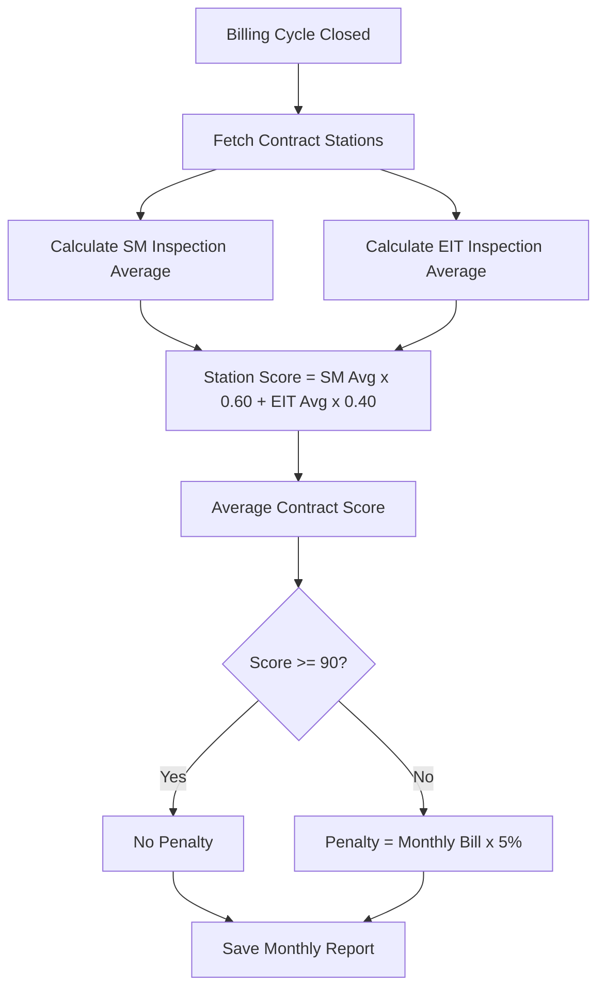
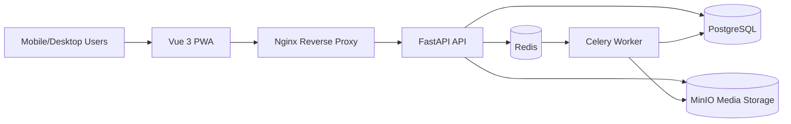

# Functional and Technical Workflows

## 1. Login Workflow

```mermaid
sequenceDiagram
    participant U as User
    participant FE as Vue Frontend
    participant API as FastAPI
    participant DB as PostgreSQL
    U->>FE: Enter username/password
    FE->>API: POST /auth/login
    API->>DB: Validate user and role
    API-->>FE: Access token + refresh token
    FE->>API: GET /auth/me
    API-->>FE: User profile + permissions
```

## 2. Inspection Capture Workflow

```mermaid
sequenceDiagram
    participant SM as SM/EIT
    participant FE as Vue PWA
    participant API as FastAPI
    participant DB as PostgreSQL
    participant OBJ as MinIO
    SM->>FE: Start inspection
    FE->>API: GET /inspections/checklist
    API->>DB: Fetch contract, station, attributes, sub-areas, grading
    API-->>FE: Checklist
    SM->>FE: Capture GPS, photos, videos, grades
    FE->>API: POST /inspections/{id}/media
    API->>OBJ: Store file
    API->>DB: Save media metadata
    FE->>API: POST /inspections/{id}/submit
    API->>DB: Validate, lock and submit inspection
    API-->>FE: Submission complete
```

## 3. Review Workflow

```mermaid
stateDiagram-v2
    [*] --> DRAFT
    DRAFT --> UNDER_LINE_MANAGER_REVIEW: Submit
    UNDER_LINE_MANAGER_REVIEW --> RETURNED_FOR_CLARIFICATION: Return
    RETURNED_FOR_CLARIFICATION --> UNDER_LINE_MANAGER_REVIEW: Resubmit
    UNDER_LINE_MANAGER_REVIEW --> LINE_MANAGER_RECOMMENDED: Recommend
    LINE_MANAGER_RECOMMENDED --> DGM_APPROVED: Approve
    LINE_MANAGER_RECOMMENDED --> DGM_REJECTED: Reject
    LINE_MANAGER_RECOMMENDED --> GM_REVIEW_REQUIRED: Send to GM
    GM_REVIEW_REQUIRED --> GM_REVIEWED: GM Reviews
    DGM_APPROVED --> CLOSED
    DGM_REJECTED --> CLOSED
    GM_REVIEWED --> CLOSED
```

## 4. Monthly KPI-6 Calculation

```mermaid
flowchart TD
    A[Billing Cycle Closed] --> B[Fetch Contract Stations]
    B --> C[Calculate SM Inspection Average]
    B --> D[Calculate EIT Inspection Average]
    C --> E[Station Score = SM Avg x 0.60 + EIT Avg x 0.40]
    D --> E
    E --> F[Average Contract Score]
    F --> G{Score >= 90?}
    G -->|Yes| H[No Penalty]
    G -->|No| I[Penalty = Monthly Bill x 5%]
    H --> J[Save Monthly Report]
    I --> J
```

## 5. End-to-End Technical Flow

```mermaid
flowchart LR
    USER[Mobile/Desktop Users] --> VUE[Vue 3 PWA]
    VUE --> NGINX[Nginx Reverse Proxy]
    NGINX --> API[FastAPI API]
    API --> PG[(PostgreSQL)]
    API --> MINIO[(MinIO Media Storage)]
    API --> REDIS[(Redis)]
    REDIS --> CELERY[Celery Worker]
    CELERY --> PG
    CELERY --> MINIO
```
