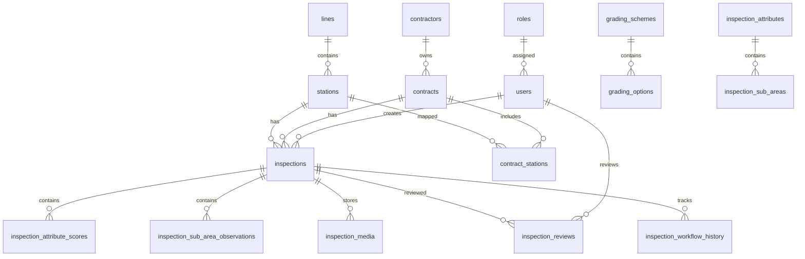

# Database Schema Reference

## Important Tables

### Identity and Access

- `roles`
- `users`
- `user_station_access`
- `user_line_access`

### Master Data

- `lines`
- `stations`
- `contractors`
- `contracts`
- `contract_stations`
- `grading_schemes`
- `grading_options`
- `inspection_attributes`
- `inspection_sub_areas`

### Inspection Transactions

- `inspections`
- `inspection_attribute_scores`
- `inspection_sub_area_observations`
- `inspection_media`
- `inspection_reviews`
- `inspection_workflow_history`

### KPI and Penalty

- `billing_cycles`
- `monthly_bill_values`
- `monthly_station_scores`
- `monthly_contract_scores`
- `penalty_calculations`

### Audit and Notification

- `audit_logs`
- `notifications`

## ER Diagram

