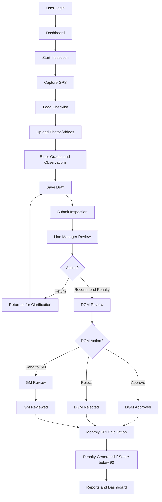
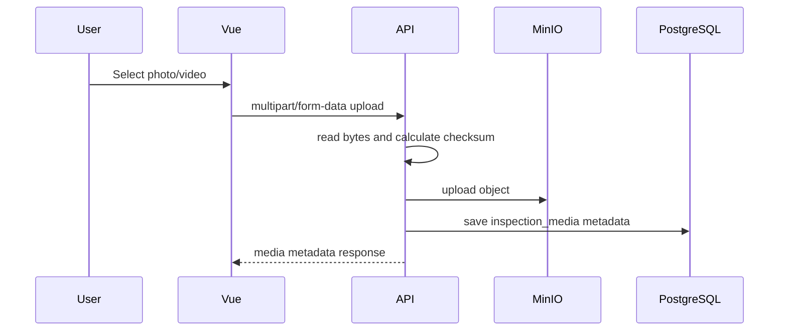

# End-to-End Workflow Tutorial

This document explains the complete workflow from user login to inspection submission, review, KPI calculation and penalty generation.

---

## 1. Actors in the system

```text
Station Manager             Creates SM inspections
External Inspection Team    Creates EIT inspections
Line Manager / AM/Mgr       Reviews inspection and recommends penalty
DGM Line / DGM HK           Approves/rejects/modifies penalty stage
GM/Ops                      Final review if required
HK Cell Admin               Manages contracts, EIT, billing and KPI setup
Super Admin                 Full system administration
```

---

## 2. Complete data flow



---

## 3. Login workflow

### Frontend file

```text
frontend/src/views/LoginView.vue
frontend/src/stores/auth.js
```

### Backend file

```text
backend/app/api/v1/endpoints/auth.py
backend/app/core/security.py
backend/app/core/deps.py
```

### Flow

```text
1. User opens /login.
2. User enters username and password.
3. Frontend calls POST /api/v1/auth/login.
4. Backend checks username and password hash.
5. Backend creates access token and refresh token.
6. Frontend stores tokens.
7. Frontend calls /api/v1/auth/me or stores user details.
8. User is redirected to dashboard.
```

### Important backend validation

```text
User must exist.
Password must match.
User must be active.
```

---

## 4. Dashboard workflow

### Frontend file

```text
frontend/src/views/DashboardView.vue
```

### Backend file

```text
backend/app/api/v1/endpoints/dashboard.py
```

### API

```text
GET /api/v1/dashboard/summary
```

### Data shown

```text
contracts count
stations count
inspections count
pending reviews count
generated penalties count
```

---

## 5. Start inspection workflow

### Frontend file

```text
frontend/src/views/InspectionStartView.vue
```

### Backend file

```text
backend/app/api/v1/endpoints/inspections.py
backend/app/services/inspection_service.py
```

### APIs

```text
GET  /api/v1/master/bootstrap
POST /api/v1/inspections/start
```

### Frontend steps

```text
1. Load contracts and stations from /master/bootstrap.
2. User selects contract.
3. User selects station.
4. User selects inspection type.
5. Browser captures GPS.
6. User clicks Start Inspection.
```

### Backend steps

```text
1. Check user station access.
2. Check station is mapped to contract.
3. Generate inspection number.
4. Save GPS, device info and remarks.
5. Set status DRAFT.
6. Set is_before_10am and is_late flags.
7. Insert workflow history.
8. Insert audit log.
```

### Created records

```text
inspections
inspection_workflow_history
audit_logs
```

---

## 6. Checklist load workflow

### API

```text
GET /api/v1/inspections/checklist?contract_id=1&station_id=1
```

### Backend returns

```text
contract details
grading options
inspection attributes
sub-areas under each attribute
```

### Frontend uses this to build dynamic form

```text
AttributeCard for each attribute
Sub-area rows inside each card
Grade dropdown from grading options
```

This means the form can change through master data without changing frontend code.

---

## 7. Media upload workflow

### Frontend file

```text
frontend/src/views/InspectionFormView.vue
frontend/src/components/AttributeCard.vue
```

### Backend file

```text
backend/app/api/v1/endpoints/inspections.py
backend/app/services/media_service.py
```

### API

```text
POST /api/v1/inspections/{inspection_id}/media
```

### Flow



### Why MinIO is used

```text
Photos/videos are large.
PostgreSQL should not store heavy binary files.
MinIO is on-prem and S3-compatible.
It can be migrated later to cloud object storage if required.
```

---

## 8. Save draft workflow

### API

```text
PUT /api/v1/inspections/{inspection_id}/draft
```

### Payload contains

```text
attribute_scores
observations
remarks
```

### Backend saves

```text
inspection_attribute_scores
inspection_sub_area_observations
```

### Allowed statuses for editing

```text
DRAFT
RETURNED_FOR_CLARIFICATION
```

If inspection is already submitted and not returned, backend rejects editing.

---

## 9. Submit inspection workflow

### API

```text
POST /api/v1/inspections/{inspection_id}/submit
```

### Backend validation

```text
1. User has station access.
2. Inspection is editable.
3. All active attributes have grade.
4. All applicable sub-areas have required photo count.
5. N/A sub-areas have reason.
```

### Status change

```text
DRAFT → UNDER_LINE_MANAGER_REVIEW
```

### Records changed

```text
inspections.submitted_at is set
inspection_workflow_history row inserted
audit_logs row inserted
```

---

## 10. Line Manager review workflow

### Frontend file

```text
frontend/src/views/ReviewQueueView.vue
```

### Backend file

```text
backend/app/api/v1/endpoints/reviews.py
backend/app/services/review_service.py
```

### APIs

```text
GET  /api/v1/reviews/pending
POST /api/v1/reviews/{inspection_id}/line-manager
```

### Allowed roles

```text
AM_MGR_LINE
DGM_LINE
SUPER_ADMIN
```

### Allowed actions

```text
RETURN_FOR_CLARIFICATION
RECOMMEND_PENALTY
```

### Status changes

```text
UNDER_LINE_MANAGER_REVIEW → RETURNED_FOR_CLARIFICATION
UNDER_LINE_MANAGER_REVIEW → LINE_MANAGER_RECOMMENDED
```

---

## 11. DGM review workflow

### API

```text
POST /api/v1/reviews/{inspection_id}/dgm
```

### Allowed roles

```text
DGM_LINE
DGM_HK
SUPER_ADMIN
```

### Allowed actions

```text
APPROVE
REJECT
SEND_TO_GM
```

### Status changes

```text
LINE_MANAGER_RECOMMENDED → DGM_APPROVED
LINE_MANAGER_RECOMMENDED → DGM_REJECTED
LINE_MANAGER_RECOMMENDED → GM_REVIEW_REQUIRED
```

---

## 12. GM review workflow

### API

```text
POST /api/v1/reviews/{inspection_id}/gm
```

### Allowed roles

```text
GM_OPS
SUPER_ADMIN
```

### Status change

```text
GM_REVIEW_REQUIRED → GM_REVIEWED
```

---

## 13. KPI calculation workflow

### Backend file

```text
backend/app/services/kpi_calculation_service.py
```

### API

```text
POST /api/v1/kpi/calculate/monthly
```

### Request

```json
{
  "billing_cycle_id": 1,
  "contract_id": 1
}
```

### Formula

For each inspection:

```text
Inspection score = average of attribute grade percentages
```

For each station:

```text
SM average = average score of SM inspections in billing cycle
EIT average = average score of EIT inspections in billing cycle
Final station score = SM average × 0.6 + EIT average × 0.4
```

For each contract:

```text
Contract average = average of final station scores
```

Penalty:

```text
If contract average < 90:
    penalty = monthly bill value × 5 / 100
else:
    penalty = 0
```

### Output saved in

```text
monthly_station_scores
monthly_contract_scores
penalty_calculations
```

---

## 14. Reports workflow

### API

```text
GET /api/v1/reports/inspection/{inspection_id}/pdf
```

Current report endpoint is a base implementation. Production can extend it.

Recommended final flow:

```text
User clicks Download Inspection Report
    ↓
Backend fetches inspection, scores, observations, media metadata and reviews
    ↓
Backend renders HTML template
    ↓
Worker converts HTML to PDF
    ↓
PDF stored in MinIO
    ↓
User receives download link
```

---

## 15. Audit workflow

Audit is called from service and endpoint layers.

Example events:

```text
LOGIN_SUCCESS
LOGIN_FAILED
INSPECTION_STARTED
INSPECTION_DRAFT_SAVED
INSPECTION_SUBMITTED
LINE_MANAGER_REVIEW
DGM_REVIEW
GM_REVIEW
```

Audit record stores:

```text
actor user
action
entity type
entity id
old value
new value
created time
```

Audit trail is essential because inspection records and penalty decisions must be traceable.

---

## 16. End-to-end testing scenario

Use this test scenario after deployment:

```text
1. Login as admin.
2. Confirm master data exists.
3. Login as Station Manager.
4. Start SM inspection for assigned station.
5. Upload required photos.
6. Select grade for each attribute.
7. Save draft.
8. Submit inspection.
9. Login as Line Manager.
10. Open pending review.
11. Recommend penalty.
12. Login as DGM.
13. Approve or send to GM.
14. Login as GM if required.
15. Run KPI monthly calculation.
16. Check penalty generated.
17. Download report.
18. Check audit logs.
```

---

## 17. Common workflow mistakes

### Submit fails because missing photo

Cause:

```text
Each applicable sub-area needs configured minimum photos.
```

Fix:

```text
Upload photo or mark N/A with reason.
```

### User cannot start inspection

Cause:

```text
No station access or station not mapped to contract.
```

Fix:

```text
Update user_station_access or contract_stations.
```

### KPI score is zero

Cause:

```text
No inspections in billing cycle
or inspections not in counted status
or no attribute scores
```

Fix:

```text
Check inspection_date, status and inspection_attribute_scores.
```

### Penalty not generated

Cause:

```text
Contract average >= threshold
or monthly bill value/default is zero
```

Fix:

```text
Check monthly_contract_scores and monthly_bill_values.
```
