# MCH KPI-6 Inspection Platform — Frontend, Backend, API, Database and Storage Data Flow

**Purpose:** This document explains exactly how the current Vue frontend talks to the FastAPI backend, how each Vue view uses components, which API endpoints are called, which backend files receive those calls, and how data finally moves into PostgreSQL, MinIO, Redis/Celery, dashboard charts, review workflow, KPI calculations and PDF reports.

**Recommended location inside project:**

```text
mch-inspection-platform/docs/18_FRONTEND_BACKEND_API_DATA_FLOW.md
```

---

## 1. Big Picture: What Happens When a User Uses the App

The app is a Vue single page application served by Nginx. The backend is FastAPI. PostgreSQL stores business data. MinIO stores uploaded photos and videos. Redis/Celery is used for background-style tasks where required.

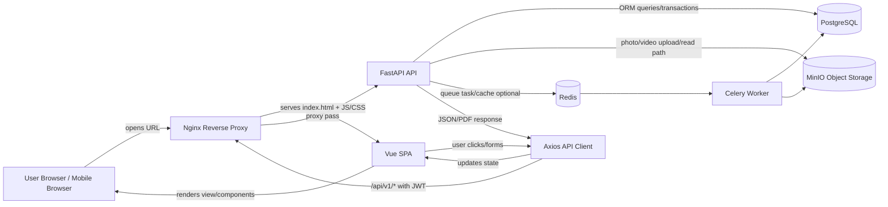

### Main idea

The frontend never talks directly to PostgreSQL, MinIO or Redis. The frontend only talks to FastAPI through HTTP API endpoints. FastAPI validates the request, checks login and permissions, performs database/storage work, then returns JSON or PDF.

---

## 2. Current Project File Map

### Frontend important files

```text
frontend/src/
├── App.vue
├── main.js
├── router/index.js
├── services/api.js
├── stores/auth.js
├── components/
│   ├── AppLayout.vue
│   ├── AttributeCard.vue
│   ├── DonutChart.vue
│   ├── SimpleBarChart.vue
│   ├── SimpleLineChart.vue
│   └── StatCard.vue
└── views/
    ├── LoginView.vue
    ├── DashboardView.vue
    ├── InspectionStartView.vue
    ├── InspectionFormView.vue
    ├── ReportsView.vue
    ├── ReviewQueueView.vue
    ├── KpiDashboardView.vue
    └── MasterDataView.vue
```

### Backend important files

```text
backend/app/
├── main.py
├── api/v1/router.py
├── api/v1/endpoints/
│   ├── auth.py
│   ├── users.py
│   ├── master.py
│   ├── inspections.py
│   ├── reviews.py
│   ├── kpi.py
│   ├── dashboard.py
│   └── reports.py
├── core/
│   ├── config.py
│   ├── database.py
│   ├── deps.py
│   ├── permissions.py
│   └── security.py
├── models/all_models.py
├── schemas/
│   ├── auth.py
│   ├── inspection.py
│   ├── kpi.py
│   ├── master.py
│   └── review.py
└── services/
    ├── audit_service.py
    ├── inspection_service.py
    ├── kpi_calculation_service.py
    ├── media_service.py
    └── review_service.py
```

---

## 3. URL Click Flow: Browser to Vue

### User action

User opens:

```text
http://server-ip/
```

or:

```text
https://mch-inspection.dmrc.local/
```

### Flow

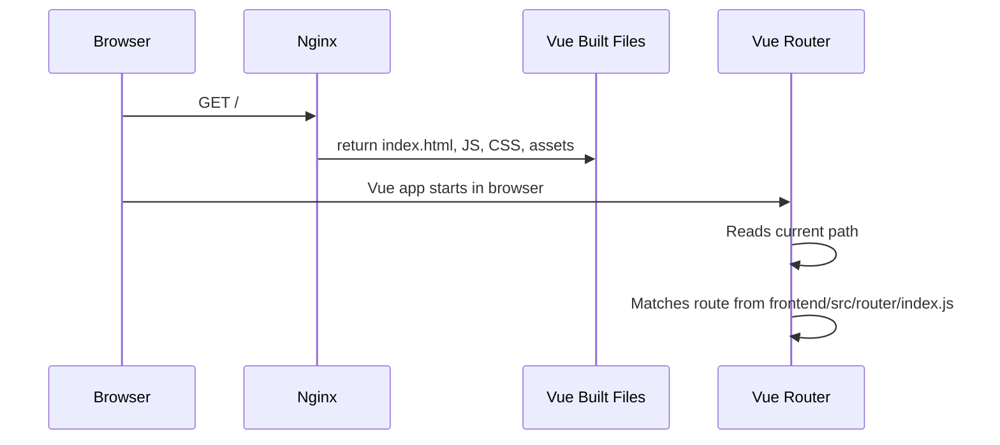

### Important detail

When the browser opens `/`, it is not a backend route. It loads `App.vue`, which contains only:

```vue
<template>
  <RouterView />
</template>
```

`RouterView` means: Vue Router will decide which page/view to show based on the current frontend URL.

---

## 4. Frontend Route Map

Defined in:

```text
frontend/src/router/index.js
```

| Frontend URL | Vue View Loaded | Auth Required | Purpose |
|---|---|---:|---|
| `/login` | `LoginView.vue` | No | Login screen |
| `/` | `DashboardView.vue` | Yes | Main dashboard and charts |
| `/inspections/start` | `InspectionStartView.vue` | Yes | Start new inspection |
| `/inspections/:id` | `InspectionFormView.vue` | Yes | Fill checklist, upload media, submit inspection |
| `/reports` | `ReportsView.vue` | Yes | Search inspections and download PDFs |
| `/reviews` | `ReviewQueueView.vue` | Yes | Line Manager/DGM/GM review queue |
| `/kpi` | `KpiDashboardView.vue` | Yes | KPI calculation and penalty view |
| `/master` | `MasterDataView.vue` | Yes | Master data display/config area |

### Route guard flow

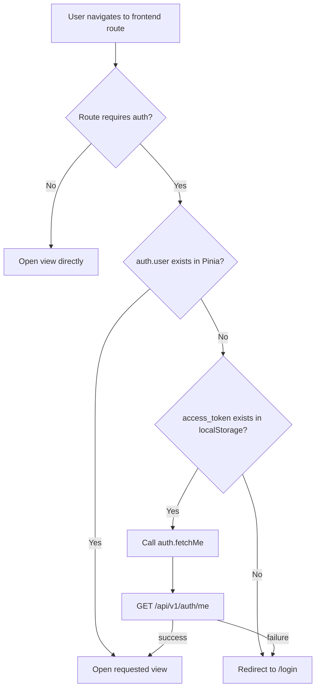

### Why this matters

If the user refreshes the browser on `/reports`, Vue memory is lost. `auth.user` becomes null. The route guard checks localStorage for token and calls `/auth/me` to restore user context.

---

## 5. Axios API Client Flow

Defined in:

```text
frontend/src/services/api.js
```

### Responsibility

This file creates one shared Axios instance for the whole frontend.

```js
export const api = axios.create({
  baseURL: '/api/v1'
})
```

This means:

```text
api.get('/dashboard/analytics')
```

actually becomes:

```text
GET /api/v1/dashboard/analytics
```

### Token injection

```js
api.interceptors.request.use((config) => {
  const token = localStorage.getItem('access_token')
  if (token) config.headers.Authorization = `Bearer ${token}`
  return config
})
```

Every API request automatically receives:

```http
Authorization: Bearer <access_token>
```

### Data flow

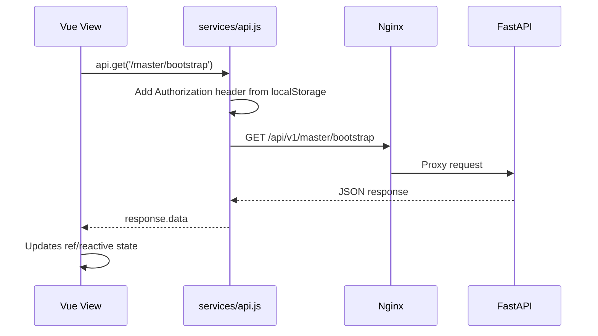

---

## 6. Backend Request Entry Flow

Defined in:

```text
backend/app/main.py
backend/app/api/v1/router.py
```

### Backend route registration

`main.py` includes:

```python
app.include_router(api_router, prefix=settings.API_PREFIX)
```

If `settings.API_PREFIX = /api/v1`, then all backend APIs start with `/api/v1`.

`api/v1/router.py` maps modules:

| Backend API Prefix | Backend File |
|---|---|
| `/api/v1/auth` | `endpoints/auth.py` |
| `/api/v1/users` | `endpoints/users.py` |
| `/api/v1/master` | `endpoints/master.py` |
| `/api/v1/inspections` | `endpoints/inspections.py` |
| `/api/v1/reviews` | `endpoints/reviews.py` |
| `/api/v1/kpi` | `endpoints/kpi.py` |
| `/api/v1/dashboard` | `endpoints/dashboard.py` |
| `/api/v1/reports` | `endpoints/reports.py` |

### Typical backend API request lifecycle

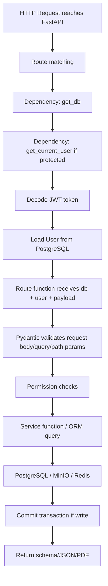

---

## 7. View-to-Component-to-API Mapping

This is the most important handover section. It explains which Vue view calls which component and which backend API.

| Vue View | Uses Components | API Calls | Backend Endpoint File | Data Returned/Changed |
|---|---|---|---|---|
| `LoginView.vue` | none | `POST /auth/login`, `GET /auth/me` | `auth.py` | JWT tokens and logged-in user |
| `DashboardView.vue` | `AppLayout`, `StatCard`, `SimpleLineChart`, `SimpleBarChart`, `DonutChart` | `GET /master/bootstrap`, `GET /dashboard/analytics`, `GET /reports/inspections/pdf` | `master.py`, `dashboard.py`, `reports.py` | Dashboard filters, cards, charts, PDF blob |
| `InspectionStartView.vue` | `AppLayout` | `GET /master/bootstrap`, `POST /inspections/start` | `master.py`, `inspections.py` | Master dropdowns, new inspection row |
| `InspectionFormView.vue` | `AppLayout`, `AttributeCard` | `GET /inspections/{id}`, `GET /inspections/checklist`, `PUT /inspections/{id}/draft`, `POST /inspections/{id}/submit`, `POST /inspections/{id}/media` | `inspections.py` | Inspection data, checklist, draft rows, media metadata, status update |
| `ReportsView.vue` | `AppLayout` | `GET /master/bootstrap`, `GET /reports/inspections/search`, `GET /reports/inspection/{id}/pdf`, `GET /reports/inspections/pdf` | `master.py`, `reports.py` | Search result table and PDF downloads |
| `ReviewQueueView.vue` | `AppLayout` | `GET /reviews/pending`, `POST /reviews/{id}/line-manager`, `POST /reviews/{id}/dgm`, `POST /reviews/{id}/gm` | `reviews.py` | Review queue and inspection status transitions |
| `KpiDashboardView.vue` | `AppLayout`, `StatCard`, `SimpleBarChart` | `GET /kpi/contract-scores`, `GET /kpi/penalties`, `POST /kpi/calculate/monthly` | `kpi.py` | Monthly KPI score rows and penalty rows |
| `MasterDataView.vue` | `AppLayout` | `GET /master/bootstrap` | `master.py` | Lines, stations, contracts, users, grades |

---

## 8. Login Flow in Detail

### Frontend files involved

```text
LoginView.vue
stores/auth.js
services/api.js
router/index.js
components/AppLayout.vue after login
```

### Backend files involved

```text
api/v1/endpoints/auth.py
core/security.py
core/deps.py
models/all_models.py
services/audit_service.py
```

### Flow diagram

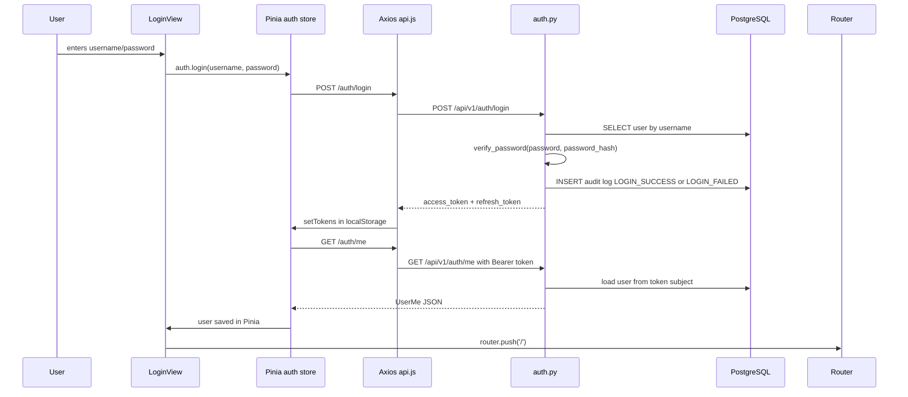

### Data in request

```json
{
  "username": "sm01",
  "password": "sm123"
}
```

### Data returned

```json
{
  "access_token": "...",
  "refresh_token": "...",
  "token_type": "bearer"
}
```

### Database touched

| Table | Action |
|---|---|
| `users` | Find user by username, update last login |
| `roles` | Read user role through relationship |
| `audit_logs` | Insert login success/failure |

### Why `/auth/me` is called after login

Login returns token only. The frontend still needs user name, role and permissions to show the correct header and route behavior. Therefore `auth.fetchMe()` calls `/auth/me` and stores user details in Pinia.

---

## 9. Dashboard Flow in Detail

### Frontend file

```text
DashboardView.vue
```

### Components used

| Component | Role |
|---|---|
| `AppLayout.vue` | Sidebar, header, DMRC logo area, logout |
| `StatCard.vue` | Displays summary cards such as inspections, stations, penalties |
| `SimpleLineChart.vue` | Displays KPI score trend |
| `SimpleBarChart.vue` | Displays station scores, inspection volume, grade distribution |
| `DonutChart.vue` | Displays latest KPI score visually |

### API calls

```js
api.get('/master/bootstrap')
api.get('/dashboard/analytics', { params })
downloadBlob('/reports/inspections/pdf', params, 'inspection-register.pdf')
```

### Flow

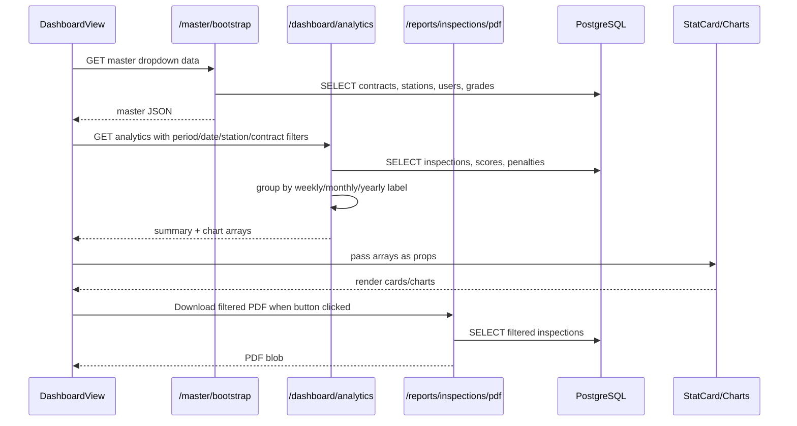

### Dashboard filters sent as query params

Example:

```text
GET /api/v1/dashboard/analytics?period=monthly&from_date=2026-01-01&to_date=2026-05-31&contract_id=1&station_id=2
```

### Backend response shape

```json
{
  "summary": {
    "contracts": 3,
    "stations": 12,
    "inspections": 155,
    "pending_reviews": 10,
    "generated_penalties": 2,
    "penalty_amount": 500000,
    "latest_score": 88.4
  },
  "score_trend": [
    { "label": "2026-01", "value": 92.5 },
    { "label": "2026-02", "value": 89.2 }
  ],
  "inspection_volume": [
    { "label": "2026-01", "value": 45 }
  ],
  "station_scores": [
    { "label": "Rajiv Chowk", "value": 87.5 }
  ],
  "grade_distribution": [
    { "label": "A", "value": 120 },
    { "label": "B", "value": 80 }
  ]
}
```

### PostgreSQL tables used

| Table | Use |
|---|---|
| `contracts` | Count contracts and filter by contract |
| `stations` | Count/filter station data |
| `inspections` | Main inspection volume and status data |
| `inspection_attribute_scores` | Score trend and grade distribution |
| `monthly_contract_scores` | Latest contract score |
| `penalty_calculations` | Penalty amount summary |

---

## 10. Start Inspection Flow in Detail

### Frontend file

```text
InspectionStartView.vue
```

### API calls

```js
api.get('/master/bootstrap')
api.post('/inspections/start', payload)
```

### User action

1. User opens **Start Inspection**.
2. Contract and station dropdowns are loaded.
3. User selects contract, station and inspection type.
4. User clicks **Capture GPS**.
5. Browser asks for location permission.
6. User clicks **Start**.
7. Backend creates inspection draft.
8. Frontend routes user to inspection form page.

### Flow diagram

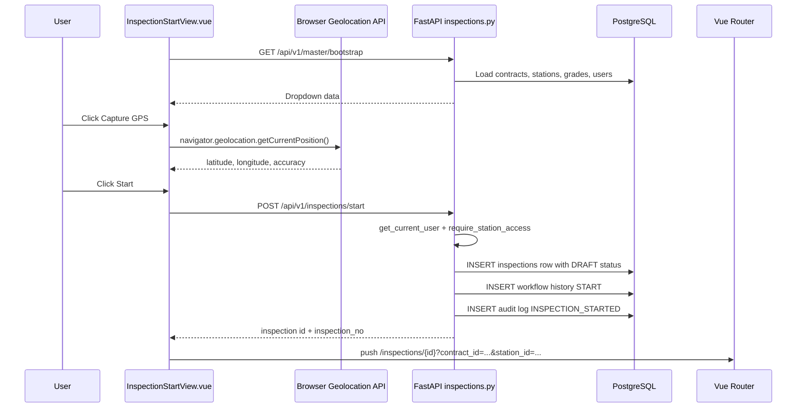

### Payload sent to backend

```json
{
  "contract_id": 1,
  "station_id": 2,
  "inspection_type": "SM_INSPECTION",
  "latitude": 28.6139,
  "longitude": 77.2090,
  "gps_accuracy": 12.5,
  "device_info": {
    "userAgent": "Mozilla/5.0 ..."
  },
  "remarks": "Initial remarks"
}
```

### Backend service

The endpoint in `inspections.py` calls:

```text
services/inspection_service.py -> create_inspection()
```

### Database rows inserted

| Table | Row created |
|---|---|
| `inspections` | Main draft inspection with contract, station, user, GPS, status `DRAFT` |
| `inspection_workflow_history` | START action |
| `audit_logs` | INSPECTION_STARTED |

---

## 11. Inspection Form and Checklist Flow

### Frontend file

```text
InspectionFormView.vue
```

### Component used

```text
AttributeCard.vue
```

### API calls on page load

```js
api.get(`/inspections/${route.params.id}`)
api.get(`/inspections/checklist?contract_id=${contractId}&station_id=${stationId}`)
```

### Data flow

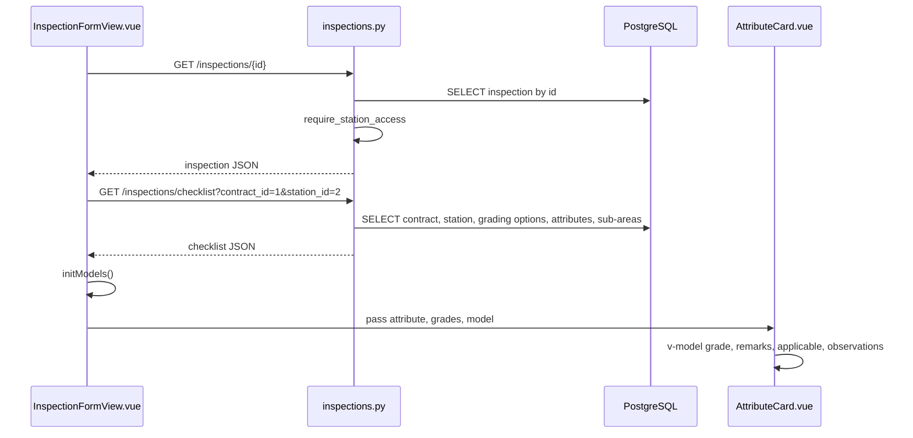

### What `initModels()` does

`InspectionFormView.vue` creates a frontend form model for each inspection attribute and each sub-area.

Conceptually:

```js
models = {
  attribute_id: {
    score: {
      attribute_id,
      grade_code,
      remarks
    },
    observations: {
      sub_area_id: {
        attribute_id,
        sub_area_id,
        is_applicable,
        na_reason,
        observation_text
      }
    }
  }
}
```

### Why this model exists

The backend needs two lists when saving/submitting:

1. `attribute_scores`
2. `observations`

The UI is shown as cards, but backend expects structured arrays. `buildPayload()` converts the card-based UI model into the backend payload.

---

## 12. AttributeCard Component Flow

### File

```text
frontend/src/components/AttributeCard.vue
```

### Props received

| Prop | Comes from | Purpose |
|---|---|---|
| `attribute` | `InspectionFormView.vue` checklist data | Contains attribute name, description and sub-areas |
| `grades` | Backend checklist grading options | Used in grade dropdown |
| `model` | Frontend local inspection form state | Stores selected grade, remarks, observations |

### Emits event

```js
emit('media-selected', { attribute, subArea: s, files })
```

### Component-to-parent data flow

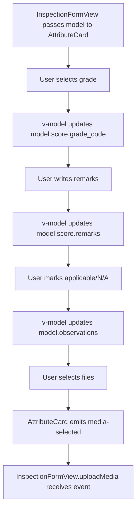

### Important point

`AttributeCard` does not call the API directly. It only emits the selected files to the parent. The parent `InspectionFormView.vue` performs the backend upload.

---

## 13. Media Upload Flow: Vue to MinIO through FastAPI

### Frontend trigger

In `AttributeCard.vue`, user selects photo/video file.

```html
<input type="file" accept="image/*,video/*" multiple @change="$emit('media-selected', ...)" />
```

Parent function in `InspectionFormView.vue`:

```js
async function uploadMedia({ attribute, subArea, files }) {
  for (const file of files) {
    const fd = new FormData()
    fd.append('attribute_id', attribute.id)
    fd.append('sub_area_id', subArea.id)
    fd.append('media_type', file.type.startsWith('video') ? 'VIDEO' : 'PHOTO')
    fd.append('file', file)
    await api.post(`/inspections/${route.params.id}/media`, fd, {
      headers: { 'Content-Type': 'multipart/form-data' }
    })
  }
}
```

### Backend endpoint

```text
POST /api/v1/inspections/{inspection_id}/media
```

Handled by:

```text
backend/app/api/v1/endpoints/inspections.py -> upload_media()
```

Uses:

```text
backend/app/services/media_service.py
```

### Media upload data flow

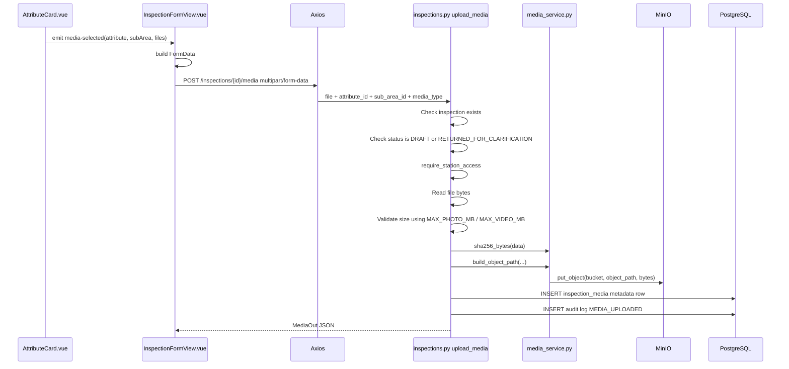

### What goes to MinIO

Actual photo/video bytes.

Example object path:

```text
contract-1/station-2/2026/05/inspection-101/photo.jpg
```

### What goes to PostgreSQL

Only metadata:

| Column | Example |
|---|---|
| `inspection_id` | 101 |
| `attribute_id` | 1 |
| `sub_area_id` | 5 |
| `media_type` | PHOTO |
| `object_path` | contract-1/station-2/.../photo.jpg |
| `original_file_name` | photo.jpg |
| `mime_type` | image/jpeg |
| `file_size` | 204800 |
| `checksum` | SHA256 hash |
| `uploaded_by` | user id |
| `processing_status` | UPLOADED |

### Why media is not stored directly in PostgreSQL

PostgreSQL is excellent for relational data and transactions. Large photos/videos are better stored in object storage. MinIO provides on-prem S3-compatible object storage. This also makes future cloud migration easier.

---

## 14. Save Draft Flow

### Frontend

`InspectionFormView.vue` button:

```html
<button @click="saveDraft">Save Draft</button>
```

Function:

```js
async function saveDraft(){
  await api.put(`/inspections/${route.params.id}/draft`, buildPayload())
}
```

### Backend

```text
PUT /api/v1/inspections/{inspection_id}/draft
```

Handled by:

```text
endpoints/inspections.py -> save_inspection_draft()
services/inspection_service.py -> save_draft()
```

### Payload sent

```json
{
  "attribute_scores": [
    { "attribute_id": 1, "grade_code": "A", "remarks": "Clean" },
    { "attribute_id": 2, "grade_code": "B", "remarks": "Minor dust" }
  ],
  "observations": [
    {
      "attribute_id": 1,
      "sub_area_id": 1,
      "is_applicable": true,
      "na_reason": null,
      "observation_text": "Floor clean"
    }
  ]
}
```

### Database effect

| Table | Action |
|---|---|
| `inspection_attribute_scores` | Insert/update selected grades and grade percentage |
| `inspection_sub_area_observations` | Insert/update applicability, N/A reason, observation text |
| `inspections` | Remarks updated if provided |
| `audit_logs` | INSPECTION_DRAFT_SAVED |

### Why draft is useful

Photos/videos may take time to upload. The inspector may not finish the full form in one go. Draft lets the user save partial structured data before final submission.

---

## 15. Submit Inspection Flow

### Frontend

```js
async function submitInspection(){
  const {data} = await api.post(`/inspections/${route.params.id}/submit`, buildPayload())
  inspection.value = data
}
```

### Backend

```text
POST /api/v1/inspections/{inspection_id}/submit
```

Handled by:

```text
endpoints/inspections.py -> submit()
services/inspection_service.py -> submit_inspection()
```

### Submit flow

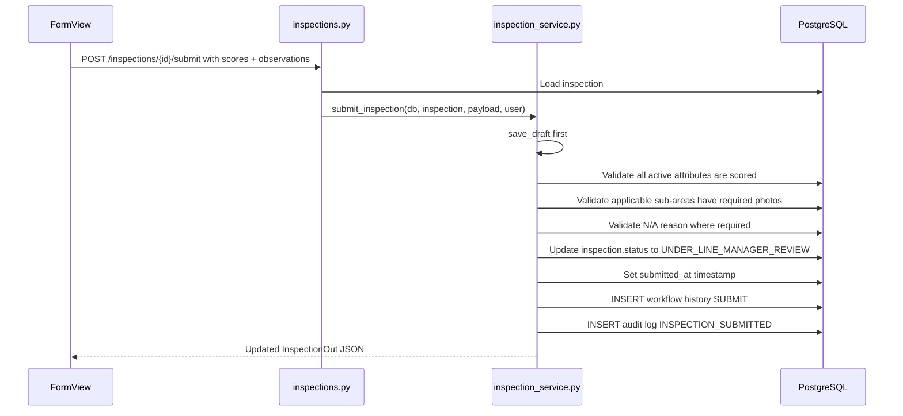

### Important validation rules

| Rule | Why |
|---|---|
| All active attributes must have grade | KPI score cannot be calculated without grade |
| Required photos must exist for applicable sub-areas | Evidence is mandatory for report integrity |
| N/A reason required if sub-area is not applicable | Prevents fake N/A usage |
| Media upload blocked after submission | Ensures submitted evidence is not silently changed |
| Inspection moves from `DRAFT` to `UNDER_LINE_MANAGER_REVIEW` | Starts review workflow |

---

## 16. Review Queue Flow

### Frontend file

```text
ReviewQueueView.vue
```

### APIs used

```js
api.get('/reviews/pending')
api.post('/reviews/{id}/line-manager', payload)
api.post('/reviews/{id}/dgm', payload)
api.post('/reviews/{id}/gm', payload)
```

### Backend files

```text
api/v1/endpoints/reviews.py
services/review_service.py
core/permissions.py
```

### Flow

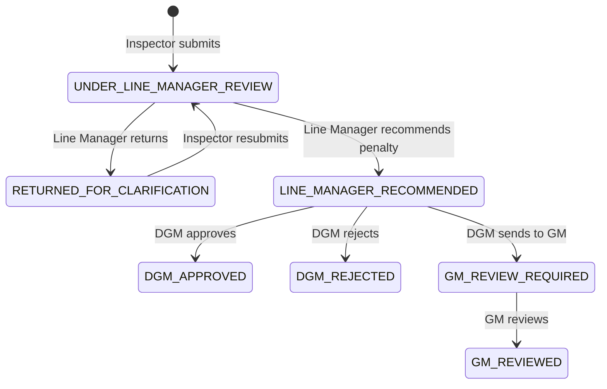

### Frontend decision logic in current project

`ReviewQueueView.vue` chooses endpoint based on current inspection status:

| Current status | Endpoint called | Payload action |
|---|---|---|
| `UNDER_LINE_MANAGER_REVIEW` | `/reviews/{id}/line-manager` | `RECOMMEND_PENALTY` |
| `LINE_MANAGER_RECOMMENDED` | `/reviews/{id}/dgm` | `APPROVE` |
| `GM_REVIEW_REQUIRED` | `/reviews/{id}/gm` | `GM_REVIEW` |

### Backend role checks

| Review stage | Allowed roles in service |
|---|---|
| Line Manager review | `AM_MGR_LINE`, `DGM_LINE`, `SUPER_ADMIN` |
| DGM review | `DGM_LINE`, `DGM_HK`, `SUPER_ADMIN` |
| GM review | `GM_OPS`, `SUPER_ADMIN` |

### Database effect

| Table | Action |
|---|---|
| `inspection_reviews` | Insert review decision/comment/penalty values |
| `inspection_workflow_history` | Insert old status, new status, action, actor |
| `inspections` | Update status |
| `audit_logs` | Insert review action |

---

## 17. Reports and PDF Flow

### Frontend file

```text
ReportsView.vue
```

### APIs used

```js
api.get('/master/bootstrap')
api.get('/reports/inspections/search', { params })
downloadBlob(`/reports/inspection/${id}/pdf`, {}, `${no}.pdf`)
downloadBlob('/reports/inspections/pdf', params, 'inspection-register.pdf')
```

### Search flow

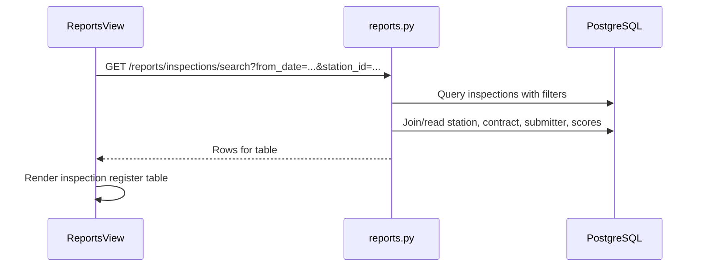

### Single inspection PDF flow

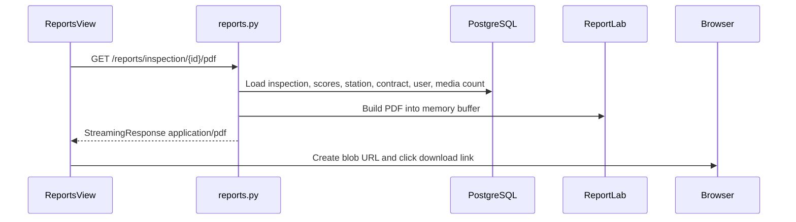

### Date-ranged register PDF flow

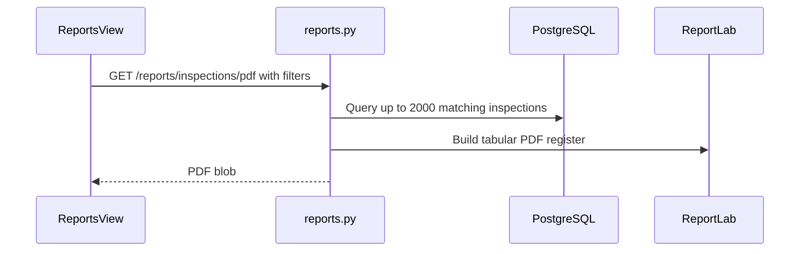

### Report filters

| Frontend field | Query parameter | Backend effect |
|---|---|---|
| From date | `from_date` | `inspection_date >= from_date` |
| To date | `to_date` | `inspection_date <= to_date` |
| Contract | `contract_id` | filters inspection contract |
| Station | `station_id` | filters inspection station |
| SM/EIT | `submitted_by` | filters inspector user |
| Type | `inspection_type` | filters SM/EIT/Special inspection |
| Status if added | `status` | filters workflow status |

---

## 18. KPI Dashboard and Penalty Calculation Flow

### Frontend file

```text
KpiDashboardView.vue
```

### APIs used

```js
api.get('/kpi/contract-scores')
api.get('/kpi/penalties')
api.post('/kpi/calculate/monthly', { billing_cycle_id, contract_id })
```

### Backend files

```text
api/v1/endpoints/kpi.py
services/kpi_calculation_service.py
```

### Calculation flow

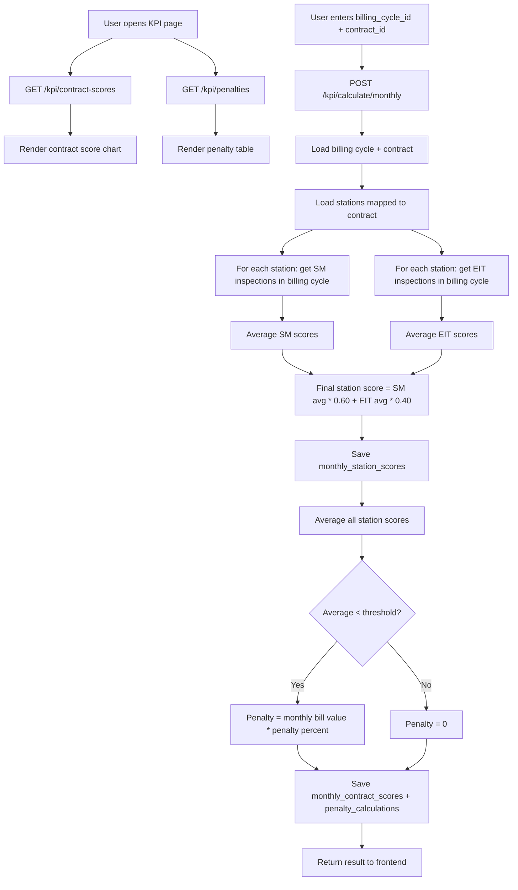

### Tables used

| Table | Use |
|---|---|
| `billing_cycles` | Date range for calculation |
| `contracts` | Threshold, penalty percent, default monthly bill |
| `contract_stations` | Which stations belong to contract |
| `inspections` | SM/EIT inspections in cycle |
| `inspection_attribute_scores` | Grade percentages used to calculate inspection score |
| `monthly_station_scores` | Final station-wise monthly scores |
| `monthly_contract_scores` | Contract average score |
| `monthly_bill_values` | Optional monthly bill override |
| `penalty_calculations` | Penalty amount and status |

---

## 19. Master Data Flow

### Frontend files using master data

| View | Why it needs master data |
|---|---|
| `DashboardView.vue` | Contract and station filters |
| `InspectionStartView.vue` | Contract and station dropdowns |
| `ReportsView.vue` | Contract, station, user filters |
| `MasterDataView.vue` | Display master data |

### API

```text
GET /api/v1/master/bootstrap
```

### Expected response contents

```json
{
  "lines": [],
  "stations": [],
  "contracts": [],
  "contractors": [],
  "users": [],
  "grading_schemes": [],
  "grading_options": []
}
```

### Why bootstrap API exists

Instead of making many small calls like `/stations`, `/contracts`, `/users`, the frontend can load all basic dropdown data in one call.

---

## 20. Authentication and Authorization Data Flow

### Token flow

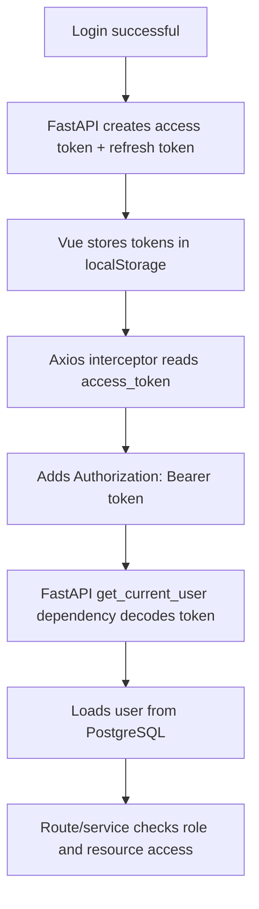

### Permission checks happen in backend

Frontend may hide buttons, but backend must always enforce permission. Current backend uses:

```text
core/deps.py -> get_current_user
core/permissions.py -> require_roles, require_station_access
```

### Example: inspection checklist permission

When frontend calls:

```text
GET /api/v1/inspections/checklist?contract_id=1&station_id=2
```

Backend performs:

```text
1. Decode token
2. Load user
3. Check user is active
4. Check user has access to station_id 2
5. Load contract and checklist
6. Return checklist
```

---

## 21. Current Endpoint Inventory

### Auth

| Method | URL | Used by |
|---|---|---|
| POST | `/api/v1/auth/login` | `LoginView.vue` through `authStore.login()` |
| POST | `/api/v1/auth/refresh` | Available for token refresh improvement |
| GET | `/api/v1/auth/me` | Route guard and login flow |
| POST | `/api/v1/auth/logout` | Available; current frontend clears token locally |

### Dashboard

| Method | URL | Used by |
|---|---|---|
| GET | `/api/v1/dashboard/summary` | Optional summary endpoint |
| GET | `/api/v1/dashboard/analytics` | `DashboardView.vue` |
| GET | `/api/v1/dashboard/contract-wise-score` | Optional dashboard detail |
| GET | `/api/v1/dashboard/pending-reviews` | Optional dashboard detail |

### Inspections

| Method | URL | Used by |
|---|---|---|
| GET | `/api/v1/inspections` | Optional listing/search |
| GET | `/api/v1/inspections/checklist` | `InspectionFormView.vue` |
| POST | `/api/v1/inspections/start` | `InspectionStartView.vue` |
| GET | `/api/v1/inspections/{inspection_id}` | `InspectionFormView.vue` |
| PUT | `/api/v1/inspections/{inspection_id}/draft` | `InspectionFormView.vue` |
| POST | `/api/v1/inspections/{inspection_id}/submit` | `InspectionFormView.vue` |
| POST | `/api/v1/inspections/{inspection_id}/media` | `InspectionFormView.vue` via `AttributeCard` event |

### Reviews

| Method | URL | Used by |
|---|---|---|
| GET | `/api/v1/reviews/pending` | `ReviewQueueView.vue` |
| POST | `/api/v1/reviews/{inspection_id}/line-manager` | `ReviewQueueView.vue` |
| POST | `/api/v1/reviews/{inspection_id}/dgm` | `ReviewQueueView.vue` |
| POST | `/api/v1/reviews/{inspection_id}/gm` | `ReviewQueueView.vue` |

### KPI

| Method | URL | Used by |
|---|---|---|
| POST | `/api/v1/kpi/calculate/monthly` | `KpiDashboardView.vue` |
| GET | `/api/v1/kpi/station-scores` | Optional detail/report use |
| GET | `/api/v1/kpi/contract-scores` | `KpiDashboardView.vue` |
| GET | `/api/v1/kpi/penalties` | `KpiDashboardView.vue` |

### Reports

| Method | URL | Used by |
|---|---|---|
| GET | `/api/v1/reports/inspections/search` | `ReportsView.vue` |
| GET | `/api/v1/reports/inspection/{inspection_id}/pdf` | `ReportsView.vue` single PDF button |
| GET | `/api/v1/reports/inspections/pdf` | `ReportsView.vue` and `DashboardView.vue` register PDF |

### Master

| Method | URL | Used by |
|---|---|---|
| GET | `/api/v1/master/bootstrap` | Dashboard, Start Inspection, Reports, Master Data |
| GET | `/api/v1/master/stations` | Optional direct use |
| POST | `/api/v1/master/stations` | Optional admin use |
| GET | `/api/v1/master/contracts` | Optional direct use |
| POST | `/api/v1/master/contracts` | Optional admin use |
| GET | `/api/v1/master/inspection-attributes` | Optional direct use |
| GET | `/api/v1/master/grading-schemes` | Optional direct use |

---

## 22. Full Inspection Lifecycle: End-to-End Data Flow

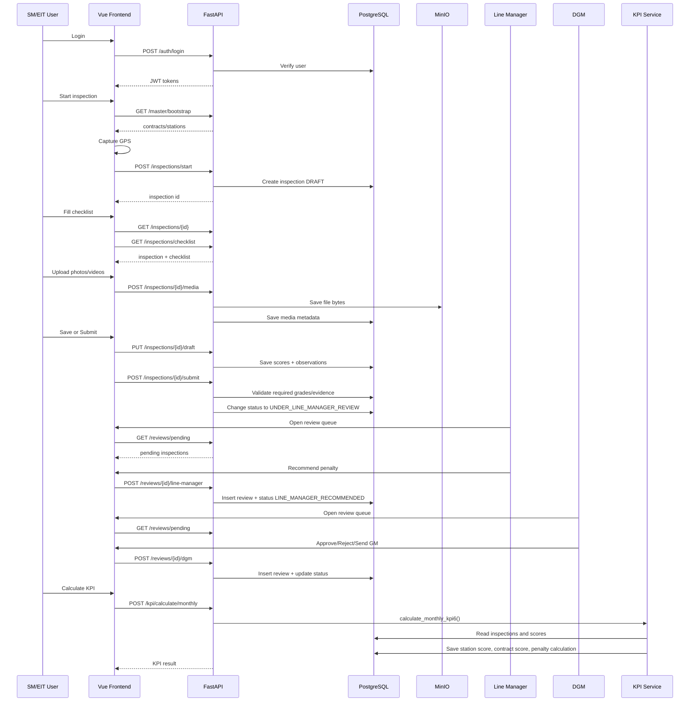

---

## 23. How Chart Data Moves from DB to Vue Components

### Example: score trend chart

1. Dashboard calls:

```text
GET /api/v1/dashboard/analytics?period=monthly&from_date=2026-01-01&to_date=2026-05-31
```

2. Backend reads inspections and scores.
3. Backend groups scores by month.
4. Backend returns:

```json
"score_trend": [
  { "label": "2026-01", "value": 92.1 },
  { "label": "2026-02", "value": 88.5 }
]
```

5. `DashboardView.vue` passes it to:

```vue
<SimpleLineChart :items="analytics.score_trend || []" />
```

6. `SimpleLineChart.vue` converts values into SVG points and renders a line.

### Example: grade distribution

Backend returns:

```json
"grade_distribution": [
  { "label": "A", "value": 40 },
  { "label": "B", "value": 25 },
  { "label": "C", "value": 10 }
]
```

Frontend renders:

```vue
<SimpleBarChart :items="analytics.grade_distribution || []" />
```

---

## 24. Data Ownership by Layer

| Data/Decision | Owned by Frontend | Owned by Backend | Owned by DB/Storage |
|---|---:|---:|---:|
| Current visible screen | Yes | No | No |
| Form temporary state before save | Yes | No | No |
| JWT validation | No | Yes | User loaded from DB |
| Role and station permission | No | Yes | Access mappings in DB |
| Inspection status transitions | No | Yes | Persisted in DB |
| Grade percentage mapping | No | Yes | Grading master in DB |
| Photo/video bytes | No | Backend streams | MinIO stores |
| Media metadata | No | Yes | PostgreSQL stores |
| KPI calculation | No | Yes | Result stored in DB |
| Chart rendering | Yes | Provides data | Data source |
| PDF generation | No | Yes | Data comes from DB |

---

## 25. Debugging Flow for Developers

### If login fails

Check:

```text
1. Browser network tab: POST /api/v1/auth/login response
2. backend/app/api/v1/endpoints/auth.py
3. User exists in users table
4. Password hash was generated correctly in seed
5. User is_active is true
6. Backend logs for LOGIN_FAILED
```

### If dashboard is blank

Check:

```text
1. Browser network tab: GET /api/v1/dashboard/analytics
2. Token exists in localStorage
3. Response status is 200, not 401/500
4. Seed data exists in inspections and scores
5. DashboardView.vue analytics ref is updated
6. Chart components receive non-empty items arrays
```

### If inspection checklist is blank

Check:

```text
1. GET /api/v1/inspections/checklist query params contract_id and station_id
2. Contract exists and has grading_scheme_id
3. GradingOption rows exist for that scheme
4. InspectionAttribute rows are active
5. InspectionSubArea rows are active
6. Frontend expects attributes to contain sub_areas; if backend returns flat attributes/sub_areas, adapt mapping
```

### If media upload fails

Check:

```text
1. Inspection status must be DRAFT or RETURNED_FOR_CLARIFICATION
2. File size must be under MAX_PHOTO_MB or MAX_VIDEO_MB
3. MinIO container must be running
4. MINIO_ENDPOINT/access key/secret must match .env
5. Bucket creation is allowed
6. Browser request Content-Type should be multipart/form-data
```

### If submit fails

Check:

```text
1. Every active attribute has grade_code
2. Grade exists in grading_options for contract grading scheme
3. Each applicable sub-area has required minimum photos
4. N/A sub-areas have reason
5. User has station access
6. Inspection is still editable status
```

### If PDF download fails

Check:

```text
1. Browser network response from /reports/...
2. Response content type should be application/pdf
3. ReportLab installed in backend requirements
4. Inspection exists and user has access
5. Date filters are valid ISO dates
```

---

## 26. Production Improvement Notes for This Flow

The current project demonstrates the complete flow. For production, improve the following:

### Frontend improvements

```text
1. Add global API error handler for 401/403/500.
2. Add token refresh interceptor using /auth/refresh.
3. Add role-based sidebar menu visibility.
4. Add proper loading skeletons and empty states.
5. Add file upload progress bar.
6. Add preview thumbnails for uploaded photos/videos.
7. Add offline draft storage for weak network station areas.
8. Add form validation before calling submit.
9. Add real station names in review queue instead of station_id only.
10. Add separate Line Manager, DGM and GM action modals instead of one generic button.
```

### Backend improvements

```text
1. Enforce RBAC on every endpoint, not only UI.
2. Add pagination to all large list endpoints.
3. Add database indexes for date, station_id, contract_id, submitted_by, status.
4. Add signed MinIO URLs for secure media viewing.
5. Add virus/content validation for uploads if required by IT policy.
6. Add async/background video duration validation.
7. Add structured JSON logs with request_id.
8. Add audit trail for PDF downloads.
9. Add immutable submitted inspection snapshots.
10. Add database backup and restore scripts into operations schedule.
```

### Nginx/deployment improvements

```text
1. Enable HTTPS.
2. Add max upload size for media.
3. Add gzip/brotli for frontend assets.
4. Add cache headers for static JS/CSS.
5. Make /api routes proxy to backend and all other routes fallback to index.html.
6. Restrict MinIO console access to admin network only.
```

---

## 27. Quick Developer Mental Model

Whenever you trace any feature, ask these questions in this order:

```text
1. Which Vue route opens the page?
2. Which Vue view file is loaded?
3. Which components does that view render?
4. Which reactive variables store data?
5. Which function is called by onMounted or button click?
6. Which api.get/post/put call is made?
7. What is the final /api/v1 URL?
8. Which FastAPI endpoint file handles that URL?
9. Which dependency checks token and DB session?
10. Which service function contains business logic?
11. Which tables are read/written?
12. Is MinIO involved for media?
13. Is Redis/Celery involved for background work?
14. What JSON/PDF returns to frontend?
15. Which component renders the returned data?
```

---

## 28. One-Line Flow Summary for Each Major Feature

| Feature | One-line flow |
|---|---|
| Login | `LoginView -> authStore -> /auth/login -> users table -> JWT -> /auth/me -> Pinia user` |
| Dashboard | `DashboardView -> /dashboard/analytics -> inspections/scores/penalties -> chart arrays -> chart components` |
| Start inspection | `InspectionStartView -> GPS + selected contract/station -> /inspections/start -> inspections DRAFT row` |
| Fill checklist | `InspectionFormView -> /inspections/checklist -> AttributeCard models -> draft/submit payload` |
| Upload media | `AttributeCard file input -> InspectionFormView FormData -> /inspections/{id}/media -> MinIO + inspection_media` |
| Submit | `InspectionFormView -> /inspections/{id}/submit -> validate grades/evidence -> status UNDER_LINE_MANAGER_REVIEW` |
| Review | `ReviewQueueView -> /reviews/pending -> review endpoint -> inspection_reviews + status transition` |
| KPI | `KpiDashboardView -> /kpi/calculate/monthly -> scores from inspections -> monthly scores + penalty` |
| Reports | `ReportsView -> /reports/search or /reports/pdf -> DB query -> table/PDF blob` |
| Master data | `Any view -> /master/bootstrap -> dropdown/options data` |

---

## 29. Suggested Next Documentation File

After this document, the next useful document should be:

```text
19_TABLE_BY_TABLE_DATA_DICTIONARY.md
```

That file should explain every PostgreSQL table, each column, who writes it, who reads it, and which screen depends on it.

